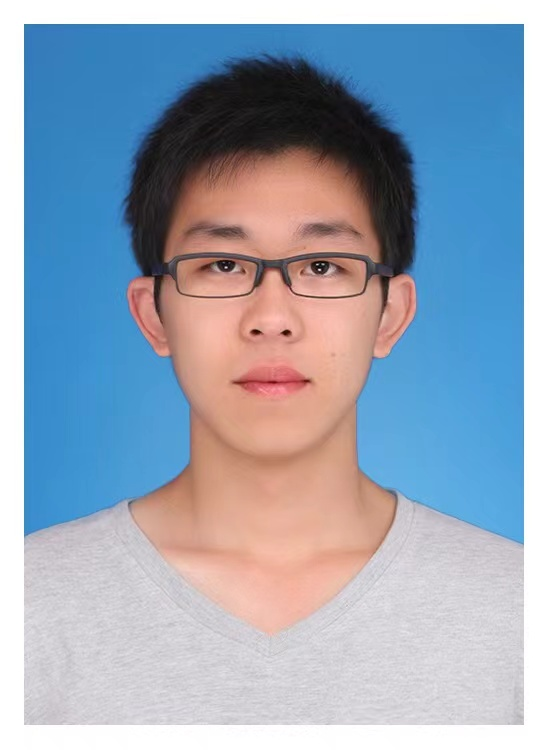

    

        
               
                          
        

    

<b>Email</b>: sunzijun@pku.edu.cn 
<a href="https://drive.google.com/file/d/1rhCjEfCc6MsGCPnMQqH4bGv4uk-Qq6TQ/view?usp=sharing">[CV] </a> 
<a href="https://scholar.google.com/citations?hl=en&user=kJ_5gK4AAAAJ">[Google Scholar] </a>
<a href="https://github.com/zijunsun">[GitHub]</a>  

### RESEARCH INTERESTS

I am a Research Scientist at Shannon.AI since 2020. Before that, I obtained my M.S. degree at Peking University 
in 2020. My research interests are natural language processing and deep learning.  
My main work is to track the state-of-the-art algorithms in natural language processing. Not only do I research 
basic NLP algorithms(e.g. QA, NER, NLI..), 
but also I explore the practical NLP applications for real-world problems, 
such as document event extraction, text error correction.  
In recent years, with the advancement of pre-training models, I have devoted myself to multimodel pre-training models. 
For Chinese, I proposed a multimodel pretraining model, 
which considered both visual and phonetic information, and this pre-trained model can carry significant syntax and 
semantic information for language understanding.

---

### PROFESSIONAL EXPERIENCE AND EDUCATION

2020.7 - present:  <b>NLP researcher</b> 
Mentor: [Dr. Jiwei Li](https://nlp.stanford.edu/~bdlijiwei/)  
<a href="https://www.shannonai.com/en">Shannon AI</a> 
Location: Haidian, Beijing, China

2017.9 - 2020.7:  <b>Graduate/Master Student</b> 
    major: computer science 
    Rank: 1 / 15  
    <a href="https://eecs.pku.edu.cn/Home/HOME.htm">School of Electronics Engineering and Computer Science</a> 
    Peking University, Beijing, China 

2013.9 - 2017.6:  <b>Undergraduate/B.S. Student</b> 
    Major: software engineering 
    Rank: 1 / 58   
    GPA: 3.61/4.0  
    <a href="http://www.sei.ynu.edu.cn/index.htm">National Pilot School of software</a> 
    Yunnan University, Yunnan, China 

---
### INTERNSHIP
2019.6 - 2020.4:  <b>research intern</b> 
Advisor: [Dr. Jiwei Li](https://nlp.stanford.edu/~bdlijiwei/), Chief Executive Officer, Shannon.ai  
Topics: Question Answering, Event Extraction 
- Proposed a new paradigm for the task of entity-relation extraction. 
  By casting the task as a multi-turn question answering problem, 
  the extraction of entities and relations is transformed to the task of identifying 
  answer spans from the context.
- Created a novel strategy for the task of named entity recognition (NER). 
  We cast the task as a query-based machine reading comprehension task.
- Implemented a Knowledge Base Question Answering System(KBQA) for the stock market, 
  the pipeline includes tagging, parsing, nl2sql.

2018.6 - 2019.4:  <b>research assistant</b> 
Advisor: [Dr. Sujian Li](http://123.56.88.210/), Associate Professor, Peking University  
Topics: Event Extraction, Graph Convolutional Network 
- Proposed a multi-view graph convolutional network for the task of event extraction.
- Introduced shortcut arcs (e.g. AMR, Parse tree, Syntax Tree) to enhance information flow.
- Captured the very long-distance dependencies by graph convolutional neural network.

---
### HONORS AND AWARDS
2018-2019 The Second Prize Scholarship, Peking University (Top 16% of school)  
2018-2019 Outstanding Student Award, Peking University (Ranked 1st in class)    
2017-2018 Outstanding Research Scholarship, Peking University 

2016-2017 Outstanding Graduates, Yunnan University  
2015-2016 The First Prize Scholarship, Yunnan University (Ranked 1st in school)  
2014-2015 The First Prize Scholarship, Yunnan University (Ranked 1st in school)  
2013-2014 China National Scholarship, Yunnan University (Ranked 1st in school) 

---
### SKILLS
**Technical**: Python, Java, MySQL, Pytorch, Tensorflow, NLP, ML, DL   
**TOEFL**: 105 （Reading 30, Listening 27, Speaking 21, Writing: 27）  
**GRE**: 330 (Verbal 170, Quantitative 160 )
