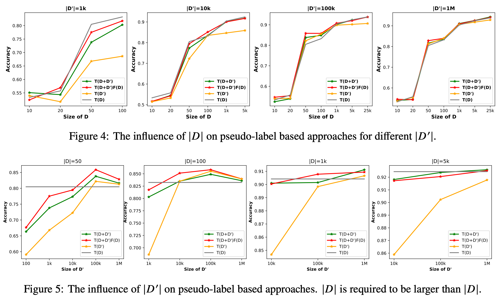

### Spell Check for Chinese

We implemented a powerful AI application to help people preform their reading and writing tasks more effectively. 
We serve hundreds of thousands of ordinary customers and dozens of enterprise customers.  
As one of the team leaders,
I participated in the design of the whole system and the realization and optimization of the core algorithms. 
Generally speaking, we designed a pipeline with two stages: detection and correction.  
For detection, we trained a Denoising Autoencoder model to detect the locations of spell errors in a sentence. 
Based on linguistic properties, we replace certain words with words that may be miswritten, 
thus generating pairs of training data.   
For correction, we designed different models for each type of spell errors, such as phonetic error, shape error,
quantifier error. For each error location, we use the weighting of features to determine the correct word.

**You can try it here: [Pitaya](https://www.mypitaya.com/)**

---

### Pretrained Graph Convolutional Neural Network for Gene Set Member Classification

Gene set member identification task aims to accurately identify gene set members, i.e., 
whether a given gene v is in a given gene set m. 
According to a pre-defined gene interact graph and gene set, 
we randomly mask half of the nodes and use the other half as visible information to 
enforce the model to predict the masked half nodes.  
The proposed neural model consists of three layers: 
the embedding layer, the GAT layer and the classification layer. 
The embedding layer initializes graph node embeddings and the weights are initialized by our 
pretrained node embedding. The GAT layer extract features and the classification layer 
predict the node type.

---

### Explore the Behavior of Semi-Supervised Learning under Large-Scale Pretraining
Here is a report on a series of experiments exploring the behavior of semi-supervised learning under large-scale pretraining.
The goal of semi-supervised learning is to utilize the unlabeled,
in-domain dataset U to improve models trained on the labeled dataset D. 
Under the context of large-scale language-model (LM) pretraining, 
how we can make the best use of U is poorly understood, we have the following questions:   
1) Is semi-supervised learning still beneficial with the presence of large-scale pretraining? 
2) Should U be used for in-domain LM pretraining or pseudo-label generation? 
3) How should the pseudo-label based semi-supervised model be actually implemented? 
4) How different semi-supervised strategies affect performances regarding D of different sizes, U of different sizes, etc.  

According to experiments and analysis, we draw the following conclusions:    
(1) with the presence of in-domain pretraining LM on U, open-domain LM pretraining is unnecessary   
(2) both the in-domain pretraining strategy and the pseudo-label based 
   strategy introduce significant performance boosts, 
   with the former performing better with larger U, 
   the latter performing better with smaller U, 
   and the combination leading to the largest performance boost   
(3) self-training (pretraining first on pseudo labels D' and then fine-tuning on D) 
   yields better performances when D is small, 
   while joint training on the combination of pseudo labels D' and the original dataset 
   D yields better performances when D is large. 

Using semi-supervised learning strategies, 
we are able to achieve a performance of around 93.8% accuracy with 
only 50 training data points on the IMDB dataset, and a competitive performance 
of 96.6% with the full IMDB dataset.

More details can be find here: [[paper](https://arxiv.org/abs/2011.08626)], [[code](https://github.com/ShannonAI/Neural-Semi-Supervised-Learning-for-Text-Classification)]

    

        

        
        

    

 
